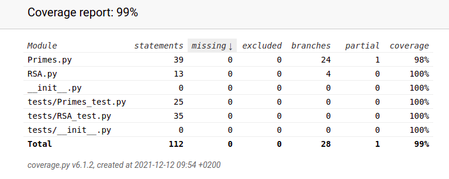
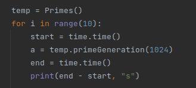
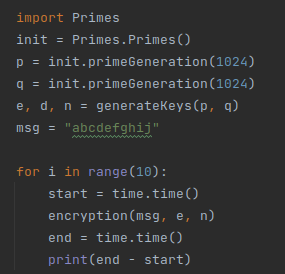
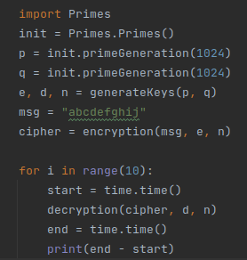

## Testausdokumentti

### Testikattavuus

### Yksikkötestaus

Jokaista sovelluksen metodia ja funktiota on testattu erikseen unittestillä yllä olevan testikattavuuden saavuttamiseksi.

`Primes` -luokan metodeja on yksikkötestattu seuraavasti `Primes_test.py` testiluokassa:
- `lowPrimes`: Pienten alkulukujen listan generoinnissa testattiin sen pituutta.
- `millerRabin`: Miller-Rabin-testiä testattiin 1024 bitin alkuluvulla ja verrattiin, onko se alkuluku.
- `checkPrimality`: Alkuluvun ensitarkistuksessa testattiin `n % prime == 0` laskutoimituksen toiminnallisuutta, jossa n on testattava alkuluku, ja prime lowPrimes listan pieni alkuluku.
- `primeGeneration`: Alkuluvun generoinnissa testattiin sen pituuden oikeellisuutta.

`RSA` :n funktioita on yksikkötestattu seuraavasti `RSA_test.py` -testiluokassa:
- `generateKeys`: Avainten generointia testattiin kahdella tunnetulla pienellä alkuluvulla, ja verrattiin, tuotettiinko oikeat parametrit RSA:n laskemista varten.
- `encryption`: Enkryptiota testattiin kahdella pre-generoidulla alkuluvulla, ja verrattiin, saatiinko oikea salausteksti samalla merkkijonolla.
- `decryption`: Dekryptiota testattiin kahdella pre-generoidulla alkuluvulla, ja verrattiin, tuleeko äskeisessä enkryption testauksessa tuotetusta salaustekstistä oikea merkkijono.

### Suorituskykytestaus

Ohjelman suorituskykyä on testattu seuraavasti:  

`Primes` -luokan alkulukujen generointia testattiin kymmenen ajokerran keskiarvolla (512, 1024, 2048 bittiset alkuluvut) ja viiden ajokerran keskiarvolla (4096 bittiset alkuluvut).

#### Alkuluvun generointi

Esimerkkinä alla on toteutettu 1024 bitin pituisen alkuluvun generoinnin testaus.

| Avaimen pituus | Keskimääräinen aika | 
| --- | --- |
| 512 bittiä | 0,0302 s |  
| 1024 bittiä | 0,3521 s | 
| 2048 bittiä | 2,5850 s | 
| 4096 bittiä | 61,0580 s |

`RSA` :n enkryptiota ja dekryptiota testattiin kymmenen ajokerran keskiarvolla eripituisilla merkkijonoilla käyttäen samaa alkuluku-avainparia (1024 bittiä pitkä) ja samaa salattavaa/purettavaa merkkijonoa.

#### Enkryptio

Esimerkkinä alla on 10 merkin pituisella merkkijonolla 1024 bitin pituisella alkuluvuilla toteutettu enkryption testaus.

| Viestin pituus | Keskimääräinen aika |
| --- | --- |
| 10 merkkiä | 0,0006 s |
| 100 merkkiä | 0,0070 s |
| 1000 merkkiä | 0,074 s |

#### Dekryptio

Esimerkkinä alla on 10 merkin pituisella merkkijonolla 1024 bitin pituisella alkuluvuilla toteutettu dekryption testaus.

| Viestin pituus | Keskimääräinen aika |
| --- | --- |
| 10 merkkiä | 0,2100 s |
| 100 merkkiä | 2,2871 s |
| 1000 merkkiä | 24,5920 s |

### Parannusehdotuksia
Alkulukujen generoinnin aikavaativuudessa on suuria heittelyitä 1024-bittisistä alkuluvuista eteenpäin, johtuen todennäköisesti `millerRabin` -metodin implementaatiosta. Tämä on huomattavissa tapauksissa, jossa se joutuu käymään kaikki 40 testikierrosta läpi, ennen kuin se löytää alkuluvun.

