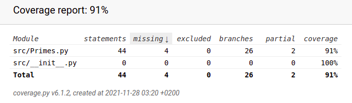

### Testausdokumentti

Ohjelman toiminnan oikeellisuus on tällä hetkellä alkulukujen generoiminen, ja koko sovelluksen oikeellisuus on RSA Algoritmilla
viestin enkryptio ja dekryptio. Olennaista on alkulukujen generoiminen nopeasti, ja sitä voidaan testata monella tavalla.

Jokaista funktiota on testattu erikseen testikattavuuden saavuttamiseksi.
Miller-Rabin-testiä testattiin 2^1024 bitin alkuluvulla.
Alkuluvun generoinnissa testattiin sen pituuden oikeellisuutta.
Pienten alkulukujen listan generoinnissa testattiin sen pituutta.
Alkuluvun ensitarkistuksessa testattiin "n modulo pieni alkuluku == 0" toiminnallisuutta.

Suorituskykytestausta ei ole vielä suoritettu.

TODO:
Suoritusanalyysi

Mitä on testattu, miten tehtiin?

Minkälaisilla syötteillä testaus tehtiin?

Miten testit voidaan toistaa?

Ohjelman toiminnan empiirisen testauksen tulokset graafisesti
